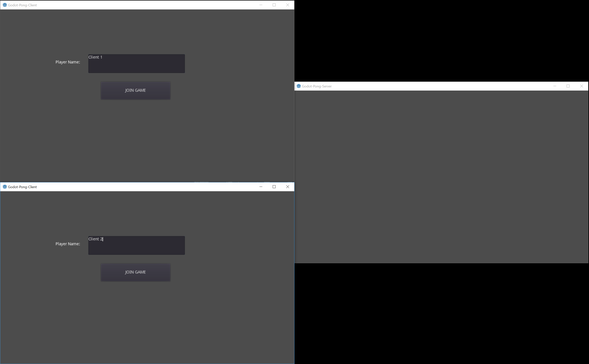
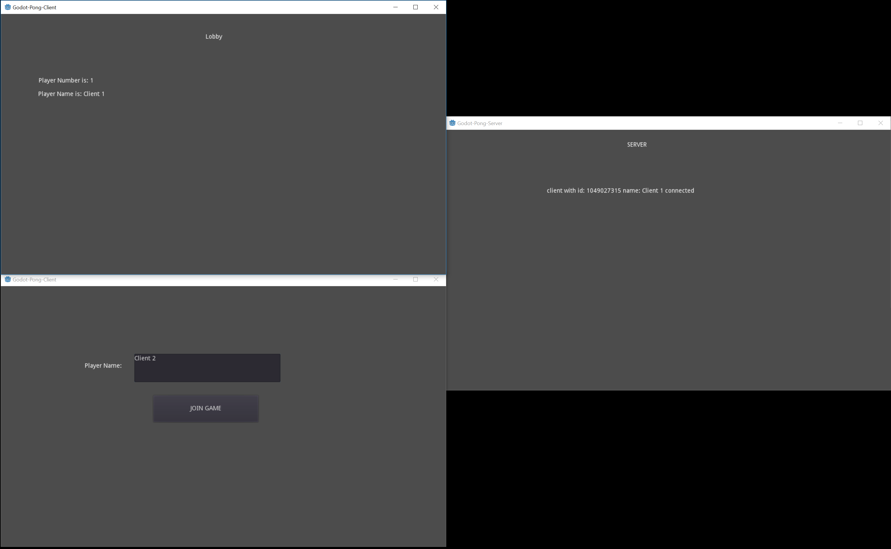
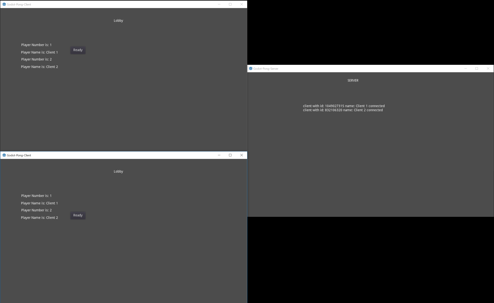
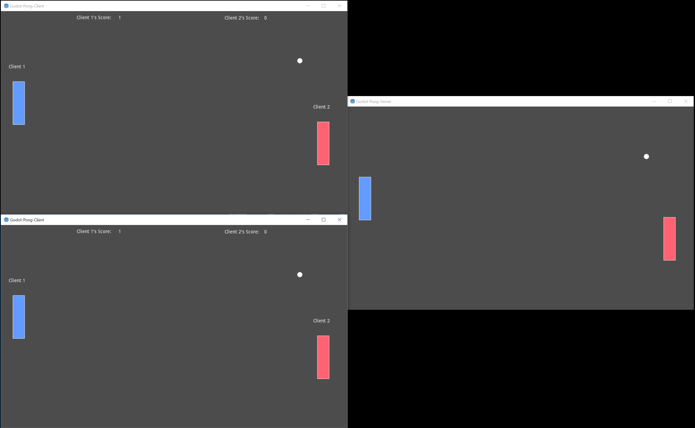
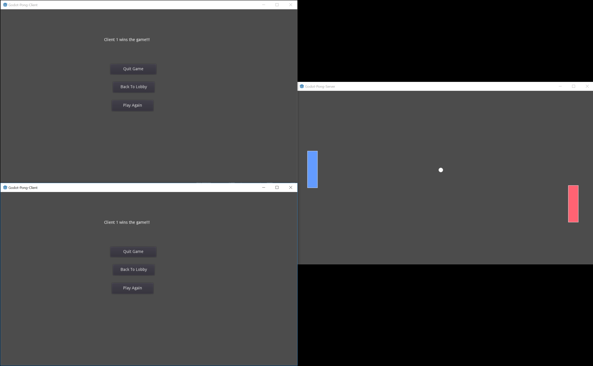

# Godot-Pong-Server
This is still in development.

This is the dedicated server for my version of the game Pong, which utilizes networked gameplay.  In the below pictures, the clients playing the game are on the right side and the left side is the server.  The server mirrors the gameplay of the clients.

The server was created completely using the Godot Engine, utilizing remote procedure calls to communicate with the players (clients).

## Screenshots:
In all of the screenshots below the clients are shown on the left, and the server is shown on the right.

In the below picture you can see the start of the game, with no clients connected.  To start you type in a name you wish to be your "In-Game" Name, as shown below, and click Join Game:

In this screenshot you can see that one client has connected indicated by the fact that the "Lobby" label shows up at the top of the player's screen.  Once in the lobby, you must wait for another client to connect to begin playing Pong.  You can also see "Client 2" has entered his name into the text box to begin playing the game:

Below we can see both clients are connected and almost ready to begin playing the game.  Both players will need to click the ready button on their screen next to their respective name to begin the head-to-head match:

Here we can see the game being played between two players, with the names they chose showing above the paddles:

We have finally gotten to the end of the game, which also shows who won the game.  If you wish to play again, both you and the other player will need to click "Play Again."  Otherwise one of you can quit the game or disconnect from the lobby:

